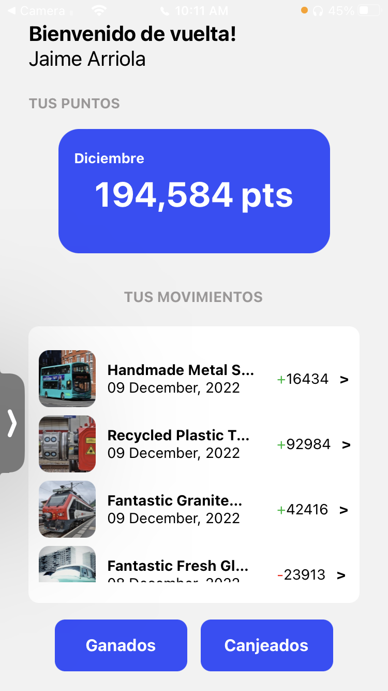
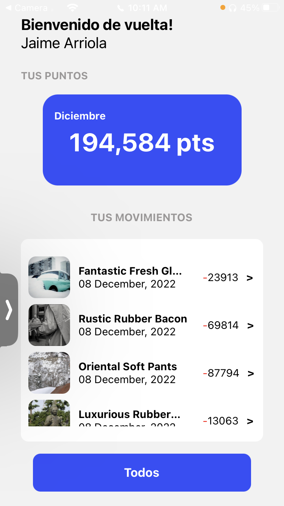
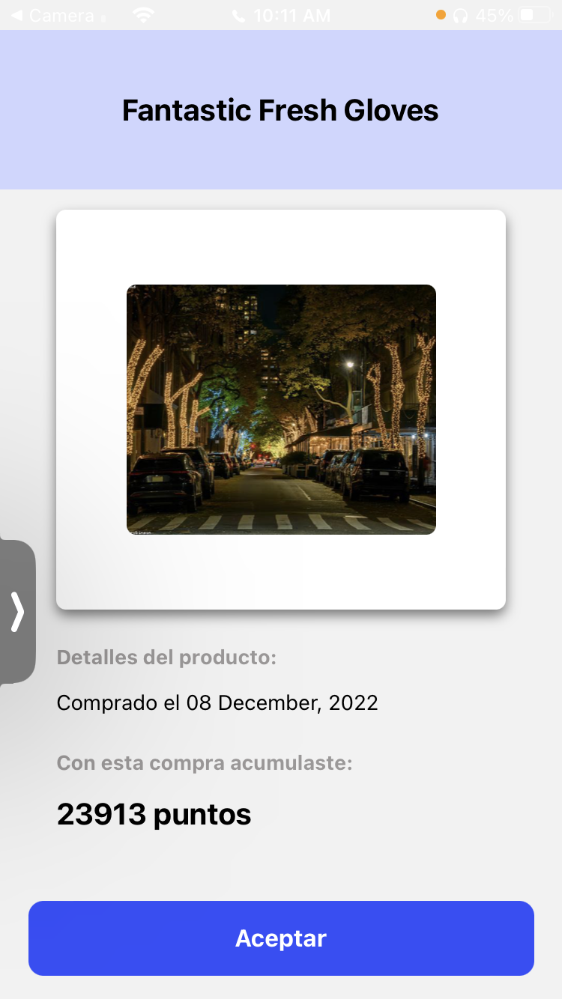
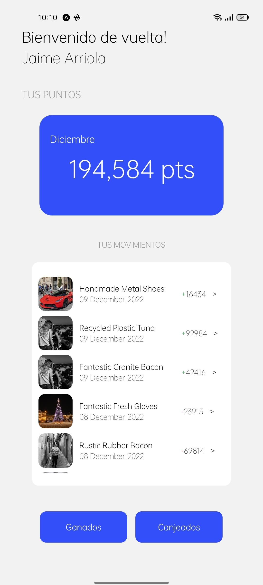
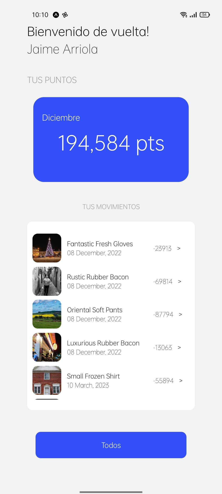
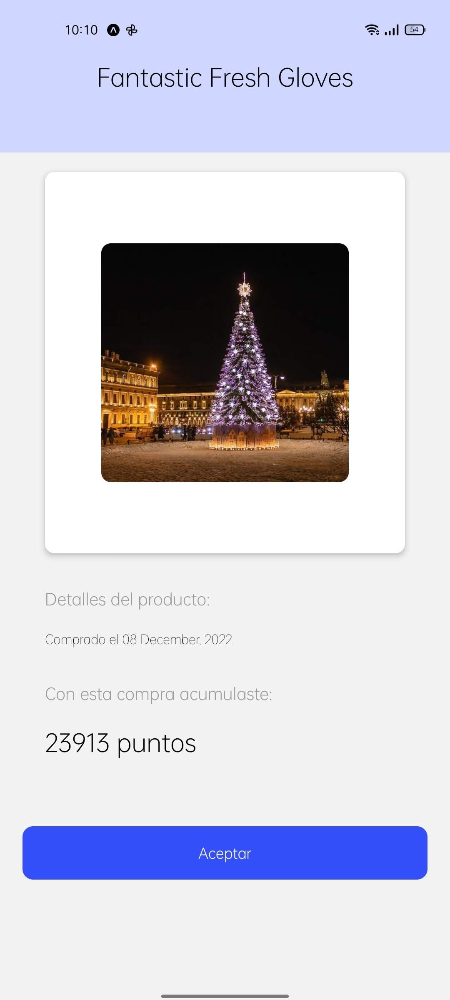

# Jaime Arriola - React Native Developer

Este es un proyecto desarrollado por Jaime Arriola, un desarrollador de React Native.

## Descripción

Challenge app

## Autor

Jaime Arriola - [Github](https://github.com/TU_USUARIO_DE_GITHUB)

## Licencia

Este proyecto está bajo la Licencia MIT - ver el archivo [LICENSE.md](LICENSE.md) para más detalles.

## Capturas de pantalla

